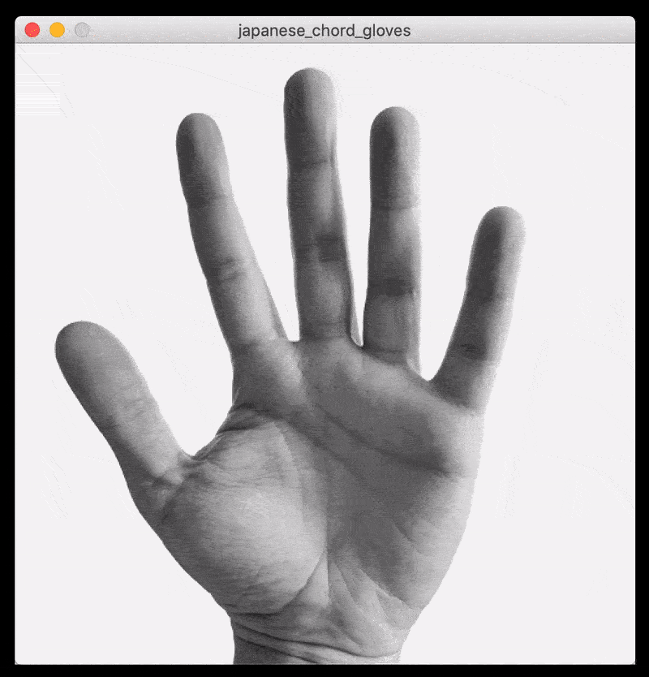
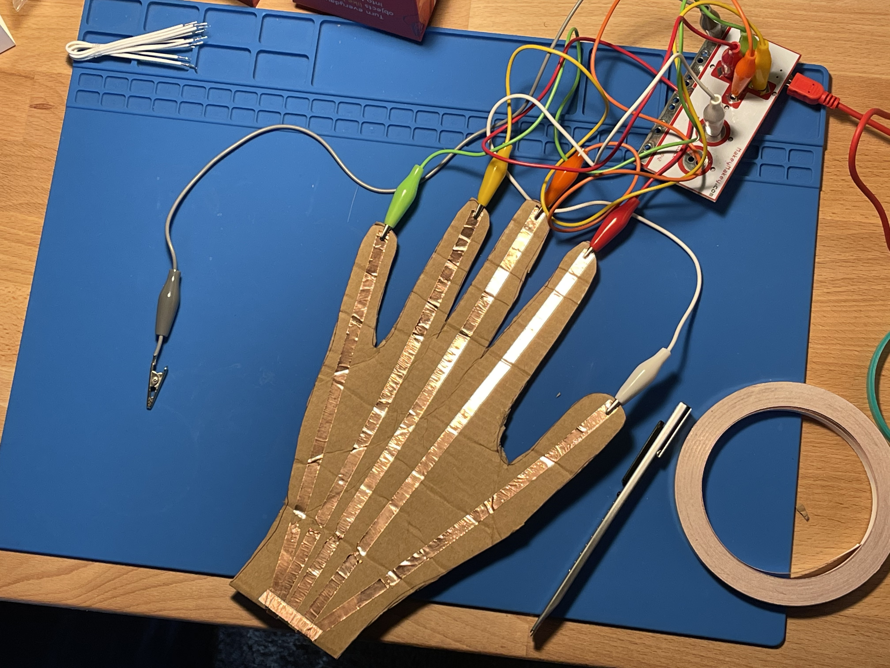
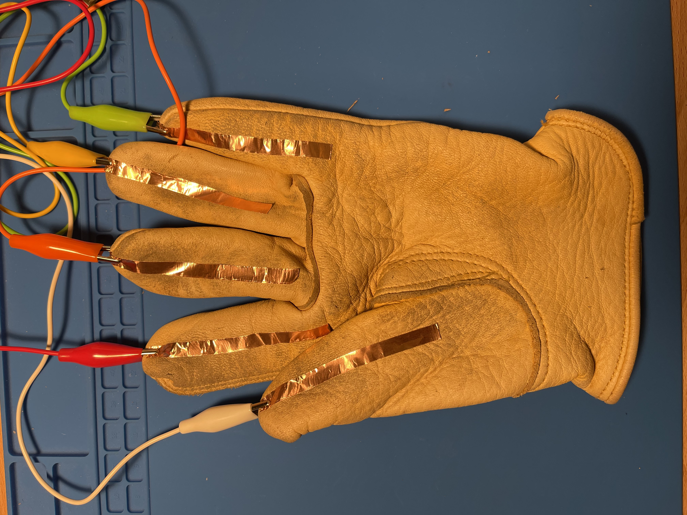
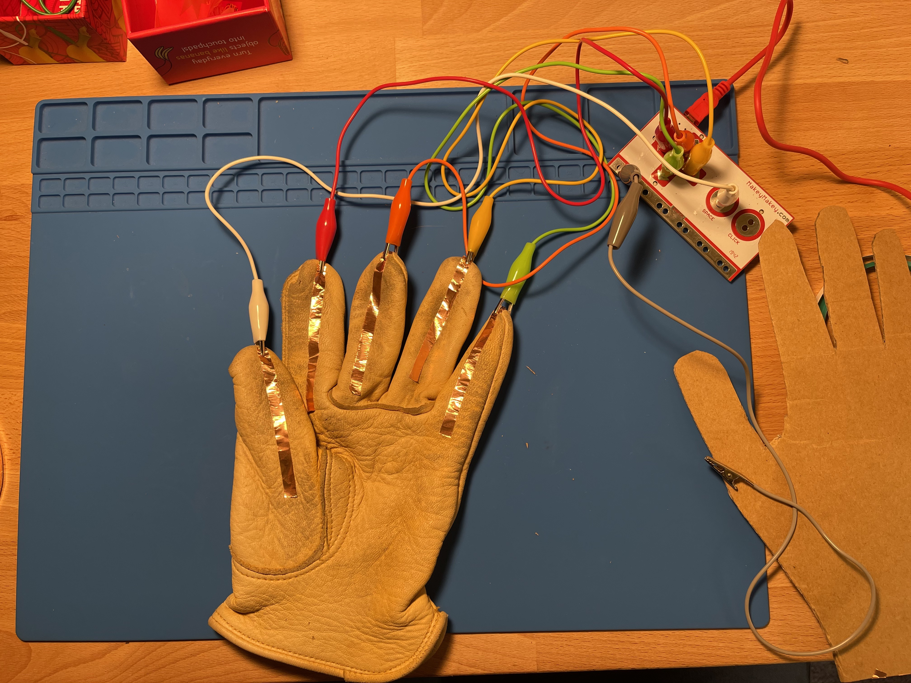
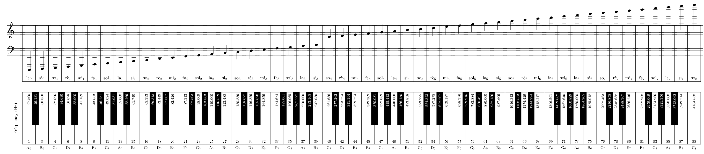

# Japanese Chords Glove

## Introduction

The idea of this project is to create a very basic musical instrument that can be played using a glove that one wears over the hand. Because I'm right-handed, I'll be making the glove for my left hand and playing with my right.

This is an exploration of chord progressions. My knowledge of music theory is very basic, so this project is also a vehicle to learn more about the technical details of musical chords and audio synthesis using Processing.

## Defining Terms

This project relies on some concepts of music theory that were important for me to learn about and understand.

### What is a "Japanese chord progression"?

***Important:*** I use the terms "Japanese chord progression" very lightly and I don't actually think it's possible to attribute these 4 basic chords to Japanese music, although you'll see why I do so below. It's an oversimplification for the purpose of serving as a point of departure from music I love.

This project was born after I saw a YouTube video about common chord progressions observed in modern Japanese classical and anime music.

See [[Sakamoto, Hisaishi, et. al.] - Common Japanese Chord Progressions](https://youtu.be/yKV58VVGV9k) on YouTube.

The four chords in much of the Japanese music discussed in the video are (illustrated here in root, 1st, and 2nd inversions to span two octaves and to make my instrument more flexible/expressive):

### Root

| Chord Number | Chord in C-Major | Root Chords | Frequencies in Hz         |
| ------------ | ---------------- | ----------- | ------------------------- |
| III          | E                | E3, G#3, B3 | 164.859, 207.727, 247.030 |
| IV           | F                | F3, A3, C4  | 174.674, 220.000, 262.686 |
| V            | G                | G3, B3, D4  | 196.065, 247.030, 293.724 |
| VI           | A                | A3, C#4, E4 | 220.000, 277.262, 329.724 |

### 1st Inversion Chords

| Chord Number | Chord in C-Major | 1st Inversion | Frequencies in Hz         |
| ------------ | ---------------- | ------------- | ------------------------- |
| III          | E                | G#3, B3, E4   | 207.727, 247.030, 329.724 |
| IV           | F                | A3, C4, F4    | 220.0, 261.686, 349.309   |
| V            | G                | B3, D4, G4    | 247.030, 293.724, 392.089 |
| VI           | A                | C#4, E4, A4   | 277.262, 329.724, 440.0   |

### 2nd Inversion Chords

| Chord Number | Chord in C-Major | 2nd Inversion | Frequencies in Hz      |
| ------------ | ---------------- | ------------- | ---------------------- |
| III          | E                | B3, E4, G#4   | 246.94, 329.63, 415.3  |
| IV           | F                | C4, F4, A4    | 261.63, 329.63, 440.0  |
| V            | G                | D4, G4, B4    | 293.67, 392.00, 493.88 |
| VI           | A                | E4, A4, C#5   | 329.63, 440.0, 554.37  |

### Some examples of these chord progressions used in Japanese music

Joe Hisaishi - One Summer's Day

https://www.youtube.com/watch?v=smn0HOvwoZ8

Ryuichi Sakamoto - Merry Christmas Mr. Lawrence

https://www.youtube.com/watch?v=hDaQF-LNrug

## Inspirations

This project is inspired by my current exploration of several topics, including ***enactment*** and ***embodiment*** in the field cognitive science. Enactment and embodiment are topics that [originated in the 1990s](https://mitpress.mit.edu/books/embodied-mind) in cognitive science. They arose from a desire to move beyond [***cognitivist***](https://en.wikipedia.org/wiki/Cognitivism_%28psychology%29) models of human cognition where thought is defined as a form of computation and our brains are basically computers made out of meat. Cognitivism originated in the 1950s and sadly still influences a lot of thought today. Embodiment proposes that our mind may be larger than our brain and that our minds are not at all like computers. One reason stated for this (among many others) is that unlike computers, our minds engage in ***[autopoiesis](https://en.wikipedia.org/wiki/Autopoiesis)***, or self organization and self-maintenance, to maintain homeostasis.

The COVID-19 pandemic has made me accutely aware that being so dependent of traditional digital interfaces, like screens, only reinforces the mind-body split. I find myself always trying to get "out of my head." In combatting this, I've tried hard to develop habits of going outside, walking on grass barefoot, playing piano, petting my dog, meditating, and generally trying to have more embodied experiences out in the world.

Making a musical instrument I could play with my hand or turning my hand into a musical instrument is an extension of these ideas and explorations.

## Equipment Used

- A [Makey Makey](https://makeymakey.com/) Kit
- An old leather gardener's glove.
- [Cardboard for prototyping](https://www.amazon.com/Corrugated-Cardboard-Sheets-24-Pack-Inserts/dp/B079QY6MMX/ref=sr_1_1?dchild=1&keywords=juvale+8.5+11+cardboard&qid=1606510018&sr=8-1)
- [Copper tape](https://www.amazon.com/Zehhe-Copper-Foil-Double-Sided-Conductive/dp/B01MR5DSCM).
- Electric Tape
- Aluminum Foil

## Software Used

- [Processing](https://processing.org/)
- [Minim](https://github.com/ddf/Minim): A Processing library for sound

## Images

### User Interface

The user interface of my project is very simple. Indeed it isn't really a user interface because you can't interact with it. Rather, it is a visualization of what is happening on the hardware. In that sense it is a way of offering ***non-auditory visual feedback*** to the user.

| Button/Finger | Color  | Behavior                                                     |
| ------------- | ------ | ------------------------------------------------------------ |
| Thumb         | White  | Shift up one octave with each tap, i.e. it starts at root, goes to 1st, then 2nd, then resets to the root. |
| Index         | Red    | III or E chord                                               |
| Middle        | Orange | IV or F chord                                                |
| Ring          | Yellow | V or G chord                                                 |
| Pinky         | Green  | VI or A chord                                                |

### Hardware

Originally, I thought through the idea using cardboard.

Owing to my limited understanding of hardware, I accidentally connected everything and created one giant circuit on this prototype. In the end I'm glad I made a rough prototype so I could work through this really basic mistake. I cut the copper tape to break the circuit and it was fine.

After some thinking and feeling a little less timid, I used an old leather gardening glove that I had lying around. Initially I thought that the copper tape would not stick to the leather, but it was actually fine. The extra leather at the fingertips turned out to be more secure for the aligator clips.

After this version I started to question how "embodied" this interaction actually was, given that I'm covering the hand with a leather glove that dampens the sensory experience. This led me to eliminate the glove entirely. Other directions I may have wanted to go in to enhance sensation might have been to use liquid latex, possibly alternative conductive materials, but electrical tape seemed a good first step.

### The software/hardware in action.

[See original video with sound on Vimeo](https://vimeo.com/484577141).

After doing this initial test, I thought it was difficult to play without any feedback as to what octave you were on, so I adjusted the code and gave a clear indication of the octave through the background grey color. This enabled me to actually start "playing" the instrument with some idea of what I was doing.

[See the original video with sound on Vimeo.](https://vimeo.com/484632647)

Here I am playing the version without the glove which includes a ring on my right pinky, instead of holding the ground electrode. Although it makes the instrument somewhat time consuming to put on and is impractical for that reason, the gloveless version affords much better interactivity between the two hands. The gloved version essentially made the hand into a static object. It didn't encourage movement, and the video of my experimentation shows that. The gloveless version, however, does encourage a more diverse array of movement and motion with both hands. The ring on the right pinky for the ground also allows more freedom of motion as it liberates all fingers to be used simultaneously while playing.

[See the original video with sound on Vimeo.](https://vimeo.com/484890097)

## What I learned and next steps

The instrument surprised me and ended up being quite expressive. The expressiveness of the project probably owes to how expressive chord progressions are in and of themselves.

Overall I learned the value of short iterations to break down or correct my assumptions. Each step of the way I was able to refine the project and add to it. When I started the project, I had a clear idea that I wanted my hand to be the musical instrument, but the role of the copper tape was not clear because I had never used it before. This project was a great example of how hands-on experimentation can help introduce new concepts.

Here are the major **assumptions/mistakes/oversights I was able to correct**:

| Step                | Assumption                                                   | Correction                                                   |
| ------------------- | ------------------------------------------------------------ | ------------------------------------------------------------ |
| Paper Prototype     | I assumed the copper tape would cover the entire hand and be connected [facepalm]. | I cut the copper tape to create separate circuits.           |
| Paper Prototype     | I assumed I would only need 4 chords in a single octave. Because the video describes only 4 chords being necessary, this left the thumb unused. The sounds were very limited. | Expand the range of the instrument by adding two more octaves (Root and 1st.). This necessitated creating a chord class as a simple new data structure that had 3 notes. |
| Leather Prototype   | I assumed that the chords didn't need to be in order [facepalm]. I was so focussed on getting the chords programmed, that I forgot that it mattered that they be in order. I chock this up to just wanting to get something working quickly and not thinking too hard about the details. | Reorganized them to be in order, lowest to highest, from index finger to pinky. |
| Leather Prototype   | I assumed I needed to zero out the pitch when each key was released in my software. This created audio artifacts in the software. | Allowed the pitches to remain where they are. Removed any keyReleased statements. Did not perform any unnecessary reassignment of pitch. |
| Leather Prototype   | I assumed you didn't need feedback when you changed octaves. This made playing very difficult. | I used 3 different shades of gray to signify the octaves. The darkest is the root. The lightest is the 2nd Inversion. |
| Gloveless Prototype | I assumed that the experience of the glove would be embodied enough to encourage a novel form of interaction. In fact, the glove deadened the sensation in my hand and turned it, largely, into a static object. | Removed the glove entirely and tried electrical tape to put the instrument directly on the body and maintain some sensation. |
| Gloveless Prototype | I assumed that it would be OK to just use a single finger on the right hand so that I could hold the ground electrode. | I created a ring out of aluminum foil that attached to my pinky so that I could play using all of my fingers. |

One basic problem with my design is the lack of visual feedback telling you what octave you are on. I think this would be an easy fix either via the user interface or via LED lights of some sort on the glove itself.

Another problem is that the wires and aligator clips encumber movement on an instrument designed to encourage freedom of motion. If I were to continue iterating, eventually the wires would need to disappear.

Another problem is that assigning notes manually to be synthesized was tedious and slow. It would be nice to have a class that did that for you. It would be a matter of creating a spreadsheet with the information in it and programmatically doing the chord progressions. This would require much more learning though.

Another potential opportunity with my Chord3 class is that I could extend it to be able to tell you what chord you are playing. This would be helpful if I ever introduced more visual feedback in the form of text on the on-screen visualization. I could imagine this being helpful for musicians.

Overall I loved the experience of prototyping with the Makey Makey. It reinforces my belief in constructivist learning strategies and "learning by doing." I also believe systems like this that abstract away challenging concepts can lead people to learn more about the world around them. Not only was I able to explore basic electronics, but this project enabled me to pursue other ideas floating around in my head like music theory and embodiment. I feel that learning in this way is concrete, very expressive, and self-reinforcing.

## External Resources

Images of notes with corresponding frequencies:

([Source](https://novaspire.wordpress.com/2016/01/18/understanding-the-frequency-spectrum-the-art-of-mixing-video/piano-scale-hertz-frequency-notes/))

Image of Notes with Corresponding Frequencies:

([Source](https://newt.phys.unsw.edu.au/jw/notes.html))

8notes.com Piano Chord Chart

https://www.8notes.com/piano_chord_chart/f.asp

## Acknowledgements

I learned how to use the basic synthesis system in Minim by looking at code that was made available online.

Keyboard Piano by Neel Virdy

https://www.openprocessing.org/sketch/99584/#

